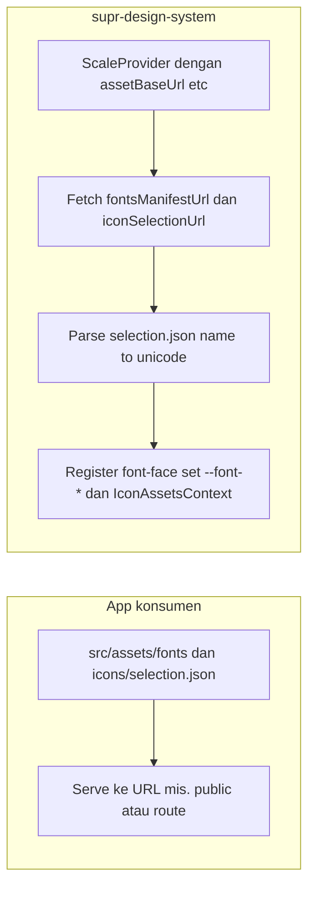
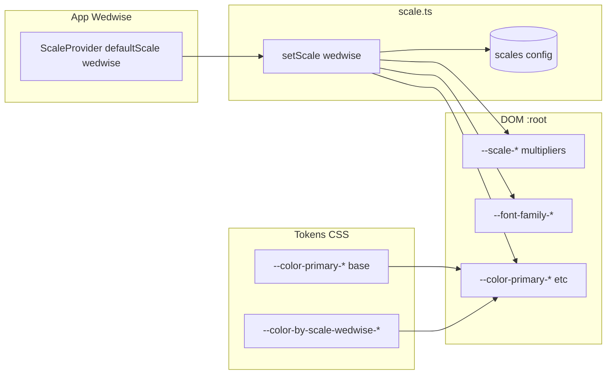

# Rencana: Per-Scale Theme (Brand Theme) di supr-design-system

## 0. Renaming library ke supr-design-system

**Nama package:** Ganti dari `@supriyadies-work/na-design-system` ke `**@supriyadies-work/supr-design-system`** (scoped).

**Yang diubah di repo na-design-system (sebelum/saat eksekusi plan):**

- **package.json:** `name` → `"@supriyadies-work/supr-design-system"`. Opsional: `repository.url` dan `bin` key jika repo/CLI ikut diganti (e.g. `supr-design-system-init`).
- **README.md:** Semua `@supriyadies-work/na-design-system` → `@supriyadies-work/supr-design-system` (install, import, @import, link repo).
- **CHANGELOG.md:** Judul/referensi ke na-design-system → supr-design-system.
- **Scripts (postinstall, generate-token-example, init-consumer):** Pesan dan perintah contoh pakai `npx @supriyadies-work/supr-design-system init`.
- **Import alias di source:** Saat ini ada import `@na-design-system/...` di beberapa komponen; itu biasanya alias ke path lokal (tsconfig paths). Setelah rename package, alias bisa tetap (internal) atau diseragamkan ke `@supriyadies-work/supr-design-system` untuk konsistensi; konsumen tetap pakai nama package yang baru.

**Konsumen (na-profile, na-portal, dll.):** Ganti dependency ke `"@supriyadies-work/supr-design-system"` dan update semua import dari package lama ke package baru.

---

## Konteks

Struktur saat ini sudah mendukung **banyak scale (multiplier)**. Yang belum: **font beda per brand**, **color tone beda per brand**, **icon set beda per brand**. Rencana ini menambah ketiga aspek itu dengan memperlakukan satu scale = satu "brand" (multiplier + opsional font + color + icon set).

---

## 1. Perluasan ScaleConfig dan scale runtime

**File:** [src/utils/scale.ts](na-design-system/src/utils/scale.ts)

- Tambah `ScaleName` baru: `"wedwise"` (dan scale lain ke depan).
- Extend `ScaleConfig` dengan field opsional:
  - `fontFamily?: { primary?: string; mono?: string; heading?: string }` — nilai string CSS (e.g. `"Playfair Display, serif"`).
  - `colorTokenPrefix?: string` — nama prefix untuk CSS vars palette scale (e.g. `"color-by-scale-wedwise"`), **atau** `colorOverrides?: Record<string, string>` untuk inject langsung hex ke `--color-primary-`* dll.
  - `iconSet?: 'default' | 'wedwise'` — key ke registry icon (lihat poin 4).
- Di `setScale(scale)`:
  - Set multiplier vars seperti sekarang (tetap).
  - Jika config punya `fontFamily`: set `--font-family-primary`, `--font-family-mono` (dan heading jika ada) di `document.documentElement.style`.
  - Jika config punya `colorTokenPrefix`: set di root setiap `--color-primary-`*, `--color-secondary-`* (dan semantic jika diinginkan) ke `var(--color-by-scale-{scale}-primary-*)`; atau jika pakai `colorOverrides`, loop dan `setProperty` tiap key.
- Tetap **backward compatible**: scale nisaaulia/supriyadies tanpa field baru berperilaku seperti sekarang (hanya multiplier).

**File:** [src/utils/ScaleProvider.tsx](na-design-system/src/utils/ScaleProvider.tsx)

- Tidak wajib diubah; `defaultScale="wedwise"` sudah cukup asal scale "wedwise" terdaftar di `scales` dan `setScale` mengurus font + color.

---

## 2. Font & icon dari konsumen (runtime, IcoMoon + folder fonts)

**Tujuan:** Konsumen cukup menaruh **IcoMoon selection.json** dan **file font** di app-nya (mis. di bawah `src/assets`), lalu design system **baca saat runtime** (fetch) dan secara dinamis meng-update font family serta icon set di modul. Ganti file → refresh → tampilan ikut berubah.

**Lokasi di app konsumen:** Path dikonfig di Provider; file fisik bisa di `src/assets/fonts`, `src/assets/icons/selection.json`. Agar bisa di-fetch di runtime, app harus **serve** aset tersebut (mis. copy ke `public/` di build, atau route yang serve dari `src/assets`). Design system hanya butuh **URL** (base URL atau full URL ke selection.json dan ke font files).

### 2.1 Konfigurasi di Provider

- Extend **ScaleProvider** (atau tambah **AssetsProvider** / **DesignSystemProvider**) dengan props untuk sumber asset konsumen:
  - `assetBaseUrl?: string` — base URL untuk asset (e.g. `''` atau `'/assets'` jika app serve dari `/assets`).
  - `iconSelectionUrl?: string` — URL lengkap atau path relatif ke selection.json (e.g. `'/icons/selection.json'` atau `assetBaseUrl + '/icons/selection.json'`).
  - `fontsManifestUrl?: string` — URL ke manifest font (lihat 2.2). Opsional jika font hanya dari token/ScaleConfig.
- Tanpa config ini: perilaku seperti sekarang (icon dari registry dalam package, font dari token/ScaleConfig).

### 2.2 Manifest font (folder fonts → “baca dari folder”)

- Di runtime browser tidak bisa list isi folder; konsumen menyediakan **manifest** (satu file JSON) yang mendeskripsikan font yang ada di “folder fonts”-nya.
- **Format manifest** (e.g. `fonts.json` di tempat yang di-serve):
  - Contoh: `{ "primary": "CustomFont.woff2", "mono": "JetBrainsMono.woff2", "icon": "iconfont.woff" }` → key = peran (primary / mono / heading / icon), value = nama file (relative ke base URL fonts).
  - Atau: `{ "primary": { "url": "/fonts/CustomFont.woff2", "family": "Custom Font" }, "icon": { "url": "/fonts/iconfont.woff", "family": "icomoon" } }` jika perlu family name eksplisit.
- Design system fetch `fontsManifestUrl` (e.g. `/fonts/fonts.json`), lalu:
  - Untuk setiap entry: inject `@font-face` (src dari URL), simpan `font-family` (dari nama file atau dari field `family`).
  - Set CSS vars di `:root`: `--font-family-primary`, `--font-family-mono`, `--icon-font-family` (dari manifest). Dengan ini font family di modul **secara dinamis** mengikuti isi manifest (setelah refresh jika file berubah).

### 2.3 IcoMoon selection.json → icon set dinamis

- **Fetch** `iconSelectionUrl` (selection.json) di runtime (saat mount Provider atau saat scale/asset config berubah).
- **Parse** format IcoMoon:
  - `icons[]` → tiap item punya `properties.name` dan `properties.code` (unicode code point). Beberapa format punya `icon.attrs`/paths untuk SVG; untuk “font icon” yang dipakai adalah **code** (unicode).
- **Bangun mapping** `iconName → unicode` (string/number). Simpan di state/context (e.g. `IconAssetsContext`).
- **Icon font:** Aset font icon (dari manifest: key `"icon"`) sudah di-register lewat 2.2 dengan `--icon-font-family`. Komponen **Icon** render dengan:
  - `font-family: var(--icon-font-family)` dan karakter unicode (dari mapping) sebagai content, **atau**
  - Tetap pakai SVG inline jika selection.json berisi path dan konsumen memilih mode SVG (opsional).
- **Fallback:** Jika selection.json belum loaded / error, pakai icon set default dalam package (registry existing) agar tidak error.

### 2.4 Urutan apply

1. Provider mount → fetch `fontsManifestUrl` (jika ada) → register @font-face → set `--font-family-`*, `--icon-font-family`.
2. Fetch `iconSelectionUrl` (jika ada) → parse → simpan name→unicode → Icon pakai mapping ini + `--icon-font-family`.
3. `setScale(...)` tetap mengurus multiplier dan (jika ada) override color/token; font dari manifest bisa override atau digabung dengan ScaleConfig (mis. scale hanya set “pakai font dari manifest” vs override nama family).

**Ringkas:** Konsumen tempel selection.json + isi folder fonts (plus manifest fonts.json); konfigurasi URL di Provider; design system baca keduanya saat runtime dan update font family + icon set secara dinamis.

**Alur konsumen (runtime):**




---

## 3. Token: color per scale

**Tujuan:** Wedwise (dan brand lain) punya palette sendiri; komponen tetap pakai `getCSSVar('color.primary.600')` / `var(--color-primary-600)`.

**Pendekatan:** Namespace per scale di tokens, lalu saat `setScale(scale)` apply override di `:root`.

- Tambah file atau bagian di `scales/wedwise.json` dengan namespace aman, mis.:
  - `color.byScale.wedwise.primary.50` … `950`, `secondary`, `neutral` (sesuai struktur [base/colors.json](na-design-system/src/tokens/base/colors.json)).
- Style Dictionary output: `--color-by-scale-wedwise-primary-500`, dll. (tidak menimpa `--color-primary-500`).
- Di `setScale('wedwise')`: untuk setiap key palette (primary, secondary, neutral, + semantic jika perlu), set di root:
  - `--color-primary-500: var(--color-by-scale-wedwise-primary-500);` … dan seterusnya.
- Scale tanpa `color.byScale.`* (nisaaulia, supriyadies) tidak di-override → pakai nilai base/semantic yang ada.

**File yang disentuh:**

- [src/config/style-dictionary.config.js](na-design-system/src/config/style-dictionary.config.js) — tidak wajib diubah; merge `src/tokens/**/*.json` sudah include file baru.
- Buat [src/tokens/scales/wedwise.json](na-design-system/src/tokens/scales/wedwise.json) (atau `wedwise.colors.json` yang di-import/direferensikan) berisi `color.byScale.wedwise.`*.
- [src/utils/scale.ts](na-design-system/src/utils/scale.ts): di `setScale`, jika scale punya palette per-scale, apply CSS vars dari `--color-by-scale-{scale}-`* ke `--color-primary-`* dll.

**Alternatif runtime-only:** ScaleConfig menyimpan object palette (hex); `setScale` meng-set `--color-primary-`* dari object. Nilai bisa dari JSON terpisah yang di-import. Kelebihan: tidak perlu ubah struktur Style Dictionary; kekurangan: getToken/getCSSVar untuk "nilai saat ini" bisa tidak konsisten jika dipanggil sebelum setScale.

---

## 4. Icon: registry dalam package + runtime dari IcoMoon (selection.json)

**Dua sumber icon:**

- **Dalam package (existing):** Registry per scale dengan SVG path di [icons.tsx](na-design-system/src/components/atoms/Icon/icons.tsx) — tetap dipakai jika konsumen tidak menyediakan selection.json.
- **Runtime dari konsumen:** Fetch selection.json → parse name→unicode → pakai icon font (dari manifest fonts, key `"icon"`) dan render dengan `font-family` + karakter unicode. Ini yang memungkinkan konsumen “tinggal tempel selection.json” dan icon ikut dinamis.

**File:** [src/components/atoms/Icon/icons.tsx](na-design-system/src/components/atoms/Icon/icons.tsx)

- Pisahkan set default ke objek bernama (e.g. `iconPathsDefault`), registry `iconPathsByScale` untuk scale yang pakai SVG dalam package (nisaaulia, supriyadies, dll.).
- Export `getIconPaths(scale): Record<string, ReactNode>` untuk fallback SVG.

**File baru (atau di bawah utils/):** Parser IcoMoon selection.json

- Fungsi `parseIcoMoonSelection(json): Record<string, number>` (name → unicode code). Baca `icons[].properties.name` dan `icons[].properties.code` (atau field unicode yang setara).

**Context untuk asset runtime**

- **IconAssetsContext:** menyimpan `{ nameToCode: Record<string, number> | null, loaded: boolean }` (dari fetch + parse selection.json). Provider (ScaleProvider atau AssetsProvider) yang fetch selection.json mengisi context ini.

**File:** [src/components/atoms/Icon/index.tsx](na-design-system/src/components/atoms/Icon/index.tsx)

- Icon component:
  - Jika ada **runtime mapping** (IconAssetsContext.nameToCode) dan nama icon ada di mapping → render dengan **icon font**: `<span style={{ fontFamily: 'var(--icon-font-family)' }}>{String.fromCodePoint(code)}</span>` (plus class untuk ukuran).
  - Else → pakai **registry SVG** seperti sekarang: `getIconPaths(scale)[name]` dengan fallback ke default.
- `IconName` bisa tetap union dari nama default + string (untuk nama dari selection.json yang tidak ada di set default), atau konsumen extend type jika perlu.

**Backward compatibility:** Tanpa `iconSelectionUrl` / tanpa manifest icon → hanya pakai registry SVG dalam package. Dengan selection.json + fonts manifest → font family dan icon set dinamis dari folder/selection konsumen.

---

## 5. Urutan implementasi yang disarankan

1. **ScaleConfig + setScale (font & color)**
  Extend [scale.ts](na-design-system/src/utils/scale.ts): ScaleName "wedwise", field opsional fontFamily, colorTokenPrefix/colorOverrides, iconSet. Di `setScale` apply multiplier + font + color vars. Backward compatible.
2. **Runtime assets: manifest font + selection.json**
  - Define format manifest font (fonts.json) dan konvensi URL (assetBaseUrl, fontsManifestUrl, iconSelectionUrl).  
  - Provider: fetch fontsManifestUrl → register @font-face, set --font-family-primary, --font-family-mono, --icon-font-family.  
  - Fetch iconSelectionUrl → parse IcoMoon (parser util) → simpan name→unicode di IconAssetsContext.  
  - Apply hanya jika URL dikonfig; kalau tidak, tidak fetch.
3. **Icon component: font + unicode vs SVG**
  Refactor [Icon/index.tsx](na-design-system/src/components/atoms/Icon/index.tsx): jika IconAssetsContext punya mapping untuk `name`, render pakai icon font + String.fromCodePoint(code); else pakai getIconPaths(scale) (SVG). Parser IcoMoon di utils.
4. **Token color per scale**
  Tambah color.byScale.wedwise di tokens; di setScale("wedwise") apply ke --color-primary-* dll.
5. **Icon registry per scale (dalam package)**
  Refactor icons.tsx ke registry iconPathsByScale; getIconPaths(scale); fallback default. Untuk scale yang tidak pakai selection.json tetap pakai SVG dari registry.
6. **Dokumentasi & konsumsi**
  README: cara pakai dengan "tempel selection.json + folder fonts" (letakkan di src/assets, serve lewat public atau route; konfigurasi assetBaseUrl, fontsManifestUrl, iconSelectionUrl). Contoh fonts.json dan export IcoMoon. Font family + icon set ter-update dinamis dari manifest/selection.
7. **Script generate token example + post-install next steps**
  Lihat section 8 di bawah.

---

## 6. Ringkasan file yang berubah


| Area          | File                                        | Perubahan                                                                                                                                                                                 |
| ------------- | ------------------------------------------- | ----------------------------------------------------------------------------------------------------------------------------------------------------------------------------------------- |
| Scale + theme | `src/utils/scale.ts`                        | ScaleName + ScaleConfig (fontFamily, colorTokenPrefix/colorOverrides, iconSet); setScale apply font + color vars                                                                          |
| Context       | `src/utils/ScaleProvider.tsx`               | Props assetBaseUrl, fontsManifestUrl, iconSelectionUrl, tokensUrl; fetch manifest + selection + tokens; register @font-face; IconAssetsContext; onAssetsLoadError / assetsLoadError (dev) |
| Parser        | `src/utils/parseIcoMoonSelection.ts` (baru) | parseIcoMoonSelection(json) → Record<name, unicode> dari icons[].properties                                                                                                               |
| Scripts       | `scripts/generate-token-example.js` (baru)  | Generate theme.json, fonts.json, placeholder icons ke target dir (cwd/src/assets atau arg)                                                                                                |
| Scripts       | `scripts/init-consumer.js` (baru, opsional) | Entrypoint bin untuk `npx ... init`; panggil generate-token-example                                                                                                                       |
| Scripts       | `scripts/postinstall.js` (baru)             | Cek apakah install sebagai dependency; print next-step (generate init, konfig Provider, link README)                                                                                      |
| Icon          | `src/components/atoms/Icon/icons.tsx`       | Registry iconPathsByScale; getIconPaths(scale); fallback SVG                                                                                                                              |
| Icon          | `src/components/atoms/Icon/index.tsx`       | useScale(); jika ada runtime mapping (IconAssetsContext) pakai icon font + unicode; else getIconPaths(scale) SVG                                                                          |
| Tokens        | `src/tokens/scales/wedwise.json`            | Baru: multiplier + color.byScale.wedwise.*                                                                                                                                                |
| Build         | Style Dictionary config                     | Tetap merge semua JSON; tidak wajib ubah                                                                                                                                                  |
| Package       | `package.json`                              | Tambah postinstall: node scripts/postinstall.js; opsional bin: supr-design-system-init → scripts/init-consumer.js; include scripts/ di files jika perlu                                   |


**Di app konsumen:** File di `src/assets/fonts` (font files + optional `fonts.json` manifest) dan `src/assets/icons/selection.json`; app harus serve aset tersebut (mis. lewat public/ atau route) agar design system bisa fetch di runtime. Setelah install, jalankan `npx @supriyadies-work/na-design-system init` untuk generate file contoh bila belum punya token.

---

## 7. Diagram alur (runtime)




Dengan ini, satu codebase na-design-system tetap dipakai; perbedaan Wedwise vs nisaaulia/supriyadies hanya pilihan scale + token (font/color) per scale + icon set.

---

## 8. Script generate token example & instruksi pasca-install

### 8.1 Script generate token example (user-triggered)

**Tujuan:** User yang belum punya token/theme bisa menjalankan satu perintah untuk menghasilkan file contoh (theme.json, fonts.json, placeholder selection.json) di project-nya, lalu diedit sesuai brand.

**Lokasi:** Di dalam package na-design-system: `scripts/generate-token-example.js` (atau `.cjs`). Bisa dijalankan dari project konsumen setelah install.

**Cara trigger (opsi):**

- **Opsi A (disarankan):** Expose bin di package.json, mis. `"bin": { "supr-design-system-init": "./scripts/init-consumer.js" }`. User jalankan: `npx @supriyadies-work/supr-design-system init` atau `yarn dlx @supriyadies-work/supr-design-system init`. Script `init-consumer.js` memanggil logika generate.
- **Opsi B:** Tanpa bin; user tambah di package.json app: `"scripts": { "design-system:init": "node node_modules/@supriyadies-work/supr-design-system/scripts/generate-token-example.js" }`, lalu `yarn design-system:init`. Script baca `process.cwd()` sebagai root app dan menulis file di sana.

**Perilaku script:**

- Menerima argumen opsional: **target directory** (default: `src/assets` atau `public/design-system` di cwd).
- Menulis file contoh: **theme.json** (struktur untuk tokensUrl), **fonts.json** (manifest font primary/mono/icon), **icons/selection.json** (placeholder IcoMoon).
- Jika file sudah ada: jangan overwrite; log "File X sudah ada, lewati." atau opsi --force.
- Setelah selesai: print "Next: 1) Edit theme.json dan fonts 2) Export IcoMoon → selection.json 3) Konfigurasi Provider (assetBaseUrl, tokensUrl, fontsManifestUrl, iconSelectionUrl). Lihat README."

**File di package:** `scripts/generate-token-example.js`, `scripts/init-consumer.js` (entrypoint bin), template inline atau `scripts/templates/`.

### 8.2 Info ketika user belum punya token

- Di **Provider**: saat fetch tokensUrl / fontsManifestUrl / iconSelectionUrl gagal (hanya di **development**), set state `assetsLoadError` dan jangan throw.
- Expose via context: `assetsLoadError` atau callback `onAssetsLoadError` agar app bisa tampilkan banner: "Design system assets tidak ditemukan. Jalankan: npx @supriyadies-work/na-design-system init"
- **Alternatif sederhana:** console.warn sekali: "[na-design-system] tokensUrl/fontsManifestUrl/iconSelectionUrl tidak bisa di-load. Untuk generate file contoh, jalankan: npx @supriyadies-work/na-design-system init. Lihat README."
- Opsional: export helper `getDesignSystemSetupInstructions(): string` untuk halaman Setup/docs.

### 8.3 Instruksi next-step setelah yarn install (post-install)

- Di package.json na-design-system: `"postinstall": "node scripts/postinstall.js"`
- **scripts/postinstall.js:** Hanya tampilkan pesan jika package di-install sebagai **dependency** (bukan saat dev di dalam repo design system). Deteksi: cek cwd atau env (INIT_CWD, npm_config_prefix).
- Jika iya, print blok teks:

```
  @supriyadies-work/na-design-system installed.

  Next steps (optional, for scalable theming):
  1. Generate example tokens & asset structure:
     npx @supriyadies-work/na-design-system init

  2. Add your assets (edit generated files or add):
     - theme.json (or use tokensUrl in ScaleProvider)
     - fonts/ + fonts.json
     - icons/selection.json (export from IcoMoon)

  3. Configure ScaleProvider:
     assetBaseUrl, tokensUrl?, fontsManifestUrl?, iconSelectionUrl?

  4. See full guide: [README link or docs URL]
```

- Skip jika env: `NA_DESIGN_SYSTEM_SKIP_POSTINSTALL=1`.
- **README:** Section "Setelah install" dengan next step yang sama.

